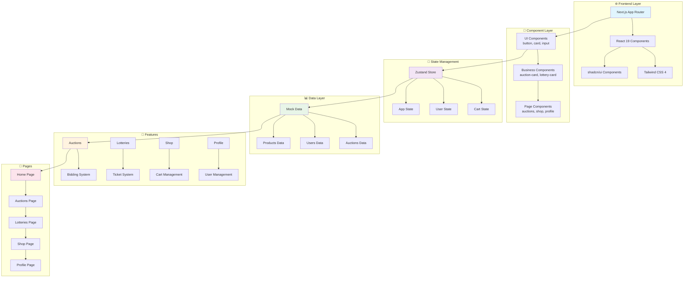
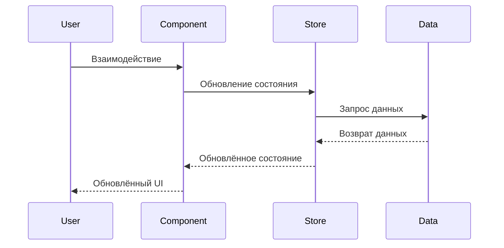
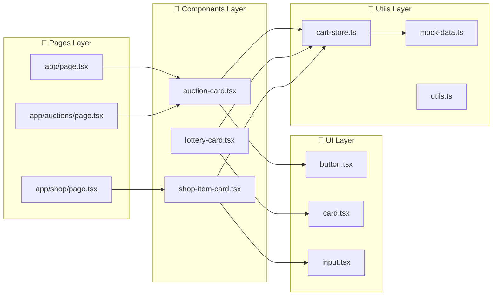
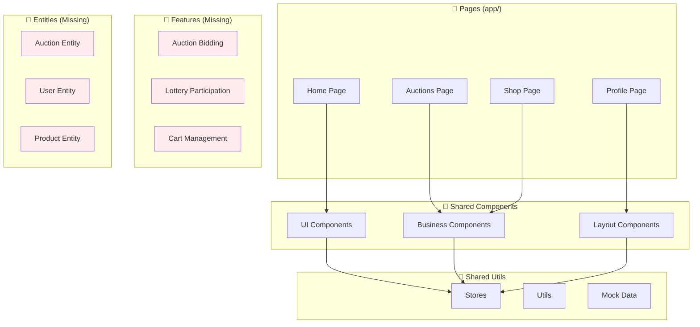

# 🏗️ Диаграмма архитектуры MerchPlace

```mermaid
graph TB
    subgraph "🌐 Frontend Layer"
        A[Next.js App Router] --> B[React 19 Components]
        B --> C[Tailwind CSS 4]
        B --> D[shadcn/ui Components]
    end
    
    subgraph "🧩 Component Layer"
        E[UI Components<br/>button, card, input] --> F[Business Components<br/>auction-card, lottery-card]
        F --> G[Page Components<br/>auctions, shop, profile]
    end
    
    subgraph "🔄 State Management"
        H[Zustand Store] --> I[Cart State]
        H --> J[User State]
        H --> K[App State]
    end
    
    subgraph "📊 Data Layer"
        L[Mock Data] --> M[Auctions Data]
        L --> N[Users Data]
        L --> O[Products Data]
    end
    
    subgraph "🎯 Features"
        P[Auctions] --> Q[Bidding System]
        R[Lotteries] --> S[Ticket System]
        T[Shop] --> U[Cart Management]
        V[Profile] --> W[User Management]
    end
    
    subgraph "📱 Pages"
        X[Home Page] --> Y[Auctions Page]
        Y --> Z[Lotteries Page]
        Z --> AA[Shop Page]
        AA --> BB[Profile Page]
    end
    
    A --> E
    E --> H
    H --> L
    L --> P
    P --> X
    
    style A fill:#e1f5fe
    style H fill:#f3e5f5
    style L fill:#e8f5e8
    style P fill:#fff3e0
    style X fill:#fce4ec
```

## 🔄 Поток данных

```mermaid
sequenceDiagram
    participant U as User
    participant C as Component
    participant S as Store
    participant D as Data
    
    U->>C: Взаимодействие
    C->>S: Обновление состояния
    S->>D: Запрос данных
    D-->>S: Возврат данных
    S-->>C: Обновлённое состояние
    C-->>U: Обновлённый UI
```

## 🏛️ Слоистая архитектура

```mermaid
graph LR
    subgraph "📄 Pages Layer"
        A[app/page.tsx]
        B[app/auctions/page.tsx]
        C[app/shop/page.tsx]
    end
    
    subgraph "🧩 Components Layer"
        D[auction-card.tsx]
        E[lottery-card.tsx]
        F[shop-item-card.tsx]
    end
    
    subgraph "🎨 UI Layer"
        G[button.tsx]
        H[card.tsx]
        I[input.tsx]
    end
    
    subgraph "🔧 Utils Layer"
        J[cart-store.ts]
        K[mock-data.ts]
        L[utils.ts]
    end
    
    A --> D
    B --> D
    C --> F
    D --> G
    E --> H
    F --> I
    D --> J
    E --> J
    F --> J
    J --> K
```

## 🎯 Feature-Sliced Design Mapping

```mermaid
graph TB
    subgraph "📄 Pages (app/)"
        A1[Home Page]
        A2[Auctions Page]
        A3[Shop Page]
        A4[Profile Page]
    end
    
    subgraph "🧩 Shared Components"
        B1[UI Components]
        B2[Business Components]
        B3[Layout Components]
    end
    
    subgraph "🔧 Shared Utils"
        C1[Stores]
        C2[Utils]
        C3[Mock Data]
    end
    
    subgraph "🎯 Features (Missing)"
        D1[Auction Bidding]
        D2[Lottery Participation]
        D3[Cart Management]
    end
    
    subgraph "🏢 Entities (Missing)"
        E1[Auction Entity]
        E2[User Entity]
        E3[Product Entity]
    end
    
    A1 --> B1
    A2 --> B2
    A3 --> B2
    A4 --> B3
    
    B1 --> C1
    B2 --> C1
    B3 --> C1
    
    style D1 fill:#ffebee
    style D2 fill:#ffebee
    style D3 fill:#ffebee
    style E1 fill:#ffebee
    style E2 fill:#ffebee
    style E3 fill:#ffebee
```

